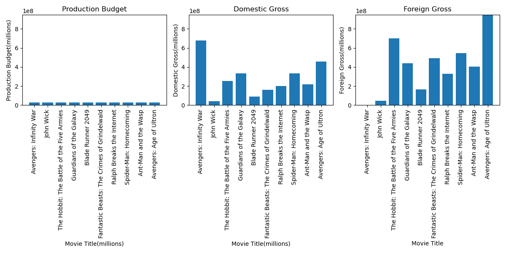

# NEW MICROSOFT'S MOVIE STUDIO (Exploratory Data Analysis)

## Introduction
The movies industry is characterized by diffrent genres of movies. They include animations, action movies, comedies etc. When producing a movie it is important to decide on what genre to get into. This can be done by determining the best perfoming movies in the market. There are different aspects that can be used to determine how different genres are perfoming example What are the top-perfoming movie genres in terms of box office revenue, and how can this information be used to guide Microsoft's new movie studio in selecting the most promising genre for their film production?

## Problem statement

## Main Objective
The objective is to identify the movie genres that have perfomed exceptionally well in terms of box office revenue. By analyzing and comparing the revenue figures across different genres, we can determine the genres that have a higher likelihood of achieving commercial success.

## Specific Objectives

## Notebook Structure
 1. Data collection
 2. Data preprocessing
 3. Exploratory data analysis(EDA)
 4. Genre perfomance analyzing
 5. Comparative analysis
 6. insights and recommendations
 7. Sensitivity analysis
 8. Reporting and Visualization
 
## Data Understanding

## Methodology

###  -Data Wrangling

##   - Exploratory Data Analysis
   **> Univariate analysis was perfomed.** From the time series, the prices are highest in 2007 and then experiences a continous decline in 2008 all the way to 2009. This may have been as a result of the political instability caused by the post election violence. The prices are 

##   - Data Preprocessing
From the graph, the data does not appear to be stationary since the rolling mean is not constant.
The p-value was 0.32 therefore we failed to reject the null hypothesis and determined that the data is not stationary. The data needed to be differenced so that it becomes stationary and fit for modelling.
##  - Modelling
The ARIMA model had an MAE of 8.87 which means that our predictions for the daily stock prices will be off by kshs 8.87. However, the predictive power of this model for in the context of stock prices is questionable because it is heavily reliant on previous values to a point where the predicted values look like they're shifted from the actual values at a certain lag.
The prophet model gave a mean absolute error of 465.3 for a one year forecast. This means that if this model makes a prediction for the share price one year from now, it would be off by kshs 465.3.
The prophet model with additional regressor features gave a mean absolute error of 373.9 for a one year forecast. This means that if this model makes a prediction for the share price one year from now, it would be off by 373.9 Ksh.
According to the Prophet model, the coefficients give the following information:

For an increase in exchange rate by 1 Ksh with the US dollar, the share price decreases by 541.2 Kshs
For an increase in GDP by 1 million, the share price decreases by 262.8 Kshs
For an increase in inflation rate by 1%, the share price decreases by 87.4 Kshs
For an increase in CBK rate by 1%, the share price decreases by 85.1 Kshs Changepoints are basically abrupt changes in a time series model which could be used as indicators of external factors affecting the trend.
It is possible that the changepoints are clustered at the end of the month because that is when businesses often close their books and release financial reports. This could lead to changes in the market sentiment, which could affect NSE values.

The mae for VAR model is 356.75 meaning that our predictions will err by kshs 356 on the yearly predictions.

Our metric of success was set such that the best performing model would be the one with the least value of MAE. In this case, that would be 
## Conclusions
Stock prices are mostly influenced by the inflation and CBK Rates.

Market anomalies like the Monday effect also largely influence the price at whick stocks trade at during the week.

The prophet model with regressors is a better forecaster as compared to the traditional forecasting models like ARIMA.

With the Prophet Model, as the prediction period is increased, the accuracy of the predictions gets weaker. Therefore, it is feasible for a short period of time.

##  Recommendations
The company/developers could use additional data sources and incorporate more economic and financial indicators into the model. Additionally, developers could experiment with different machine learning algorithms, such as deep learning and reinforcement learning, to improve the accuracy of the predictions of the prophet model.

Continuously update and retrain the model: Stock market data is constantly changing, so it's important to regularly update and retrain the model to ensure it remains accurate and effective. As new data becomes available, incorporate it into the model and retrain it to improve its accuracy.
Out of the several datasets that were collected, only some features and rows are relevant to the process. Therefore, in this step, the features that are not required from each dataset were dropped. The remaining datasets were then joined. The cbk_rates datasets were in different formats, so before joining them, they needs to be adjusted. Since the data required should only be from 2005, any data before that were dropped.
We will consider the following key aspects:
## These variations in domestic and foreign gross income indicate that different movies are performing differently in terms of audience reception and success in different markets. Despite having the same production budget, factors such as genre, storyline, star power, marketing strategies, and cultural appeal can influence the movies' performance in domestic and foreign markets.

## Analysis Results

Here is a comparison plot showing the relationship between X and Y:

You can refer to this plot to visualize the data analysis findings.

