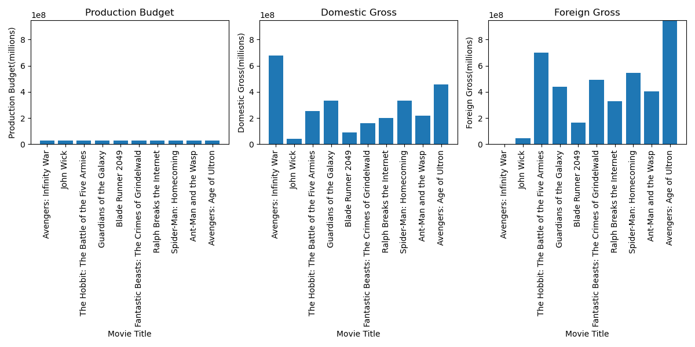

# NEW MICROSOFT'S MOVIE STUDIO (Exploratory Data Analysis)

## Introduction
   The movie industry offers various genres, including animations, action movies, comedies, and more. Selecting the right genre is crucial      when producing a movie. This exploratory data analysis aims to determine the top-performing movie genres in terms of box office revenue.    The insights gained from this analysis will guide Microsoft's new movie studio in selecting the most promising genre for their film          production.

## Problem statement
   Identify the best-performing movie genres based on box office revenue and provide recommendations for Microsoft's new movie studio.

## Main Objective
   The main objective of this analysis is to identify movie genres that have achieved remarkable commercial success in terms of box office      revenue. By analyzing and comparing revenue figures across different genres, we can determine the genres with a higher likelihood of        achieving commercial success.

## Specific Objectives
 1. Gather relevant data related to movie performance, genres, box office revenue, ratings, cast and crew information, and other pertinent factors.
 2. Clean and preprocess the collected data, addressing missing values, duplicates, and formatting issues.
 3. Conduct an in-depth exploratory data analysis (EDA) to identify patterns, relationships, and trends in the data.
 4. Analyze the performance of different genres based on box office revenue and other relevant metrics.
 5. Provide actionable insights and recommendations based on the analysis results.
 6. Perform sensitivity analysis to assess the impact of various factors on the identified insights and recommendations.
 7. Prepare a comprehensive report with effective visualizations to communicate the findings.

## Notebook Structure
 1. Data collection
 2. Data preprocessing
 3. Exploratory data analysis(EDA)
 4. Genre perfomance analyzing
 5. Comparative analysis
 6. insights and recommendations
 7. Sensitivity analysis
 8. Reporting and Visualization
 
## Data Understanding
   In this analysis, we utilized two primary datasets: IMDb movies and TMDB movies. The datasets provided comprehensive information about      movie titles, cast members, production budget, box office revenue (both foreign and domestic gross incomes), and other relevant details.

   The IMDb movies dataset contains information about various movie attributes, including title, genre, release year, runtime, ratings, and    cast information. This dataset served as a valuable resource for understanding the characteristics and features of the movies analyzed.

   The TMDB movies dataset includes essential information such as movie title, budget, revenue, and other relevant features. This dataset      enabled us to explore the financial aspects of the movies, including their production budget and box office performance.

   By combining these datasets, we were able to gain insights into the relationship between movie genres, production budget, and box office 
   revenue. Additionally, we considered factors such as star power, ratings, and other variables to analyze their impact on the movies'        commercial success.

## Methodology

###  -Data Wrangling
   The data underwent a comprehensive data wrangling process to ensure its quality and suitability for analysis. The following steps were      performed during the data wrangling phase:

   **Data Cleaning:** Handled missing values, duplicates, and formatting issues in the datasets to ensure data integrity. Applied              appropriate techniques, such as imputation or removal, to address missing values.

   **Data Integration:** Combined the IMDb movies and TMDB movies datasets based on common attributes, such as movie titles, to create a          comprehensive dataset for analysis.

##   - Exploratory Data Analysis

   In the Exploratory Data Analysis (EDA) phase, we dived into the dataset to gain insights and understand the relationships and patterns      within the data. This process involved a series of analytical techniques and visualizations to explore the movie data comprehensively.      The key steps performed during the EDA phase include:

   **Data Summary:** We generated summary statistics, such as mean, median, standard deviation, and quartiles, to gain an overall              understanding of the numerical variables in the dataset. This allowed us to identify any outliers, skewed distributions, or notable          trends.

   **Genre Distribution:** We examined the distribution of movie genres to understand the popularity and frequency of different genres in       the dataset. This analysis helped us identify the most common genres and explore potential relationships between genres and box office       revenue.

   **Box Office Revenue Analysis:** We explored the box office revenue variable to understand its distribution, range, and central               tendencies. We visualized revenue distributions using scatter plots, box plots, and bar plots to identify any significant patterns or       outliers.

   **Correlation Analysis:** We conducted correlation analysis to explore the relationships between various variables, such as production         budget, ratings, and box office revenue. By calculating correlation coefficients and generating correlation matrices, we gained             insights into the strength and direction of these relationships.

   **Visualization:** We created various visualizations, including bar plots, scatter plots, and  box plots to visualize the relationships      and patterns within the data. These visualizations aided in identifying trends, uncovering outliers, and supporting the analysis            findings.
  ## Analysis Results
   Based on the exploratory data analysis (EDA) conducted, the following key findings and insights were obtained:

   **Most Popular Genre:** The analysis revealed that the genre with the highest box office revenue is the "Musical and Performing Arts"        genre. Movies in this genre demonstrated exceptional commercial success, generating substantial revenue compared to other genres.

   **Production Budget Impact:** Surprisingly, the analysis indicated that the production budget did not have a significant impact on box      office revenue. Despite variations in the production budgets of different movies, it was not a determining factor for their commercial      success.

   **International vs. Domestic Performance:** The analysis highlighted that certain genres performed better in international markets          compared to domestic markets, while others had a stronger domestic appeal. This finding suggests that the success of a movie can be          influenced by cultural factors and audience preferences specific to different regions.

   **Local Popularity vs. Worldwide Performance:** Some movies achieved high levels of popularity and generated substantial domestic gross        income. However, these same movies often performed poorly in terms of worldwide gross revenue. This discrepancy in performance can be        attributed to cultural differences and localized appeal, which may limit the movie's international success.

   **Correlation between Domestic and Worldwide Gross:** The analysis revealed a strong positive correlation between domestic gross and        worldwide gross. This indicates that movies that performed well domestically also tended to achieve higher revenue on a global scale.        This correlation suggests that domestic success can be an indicator of potential international success.
   
  ### plots visiualizations
   **Here is a comparison plot showing the relationship between genres and gross incomes:**

   **Here is a comparison plot showing the relationship between production budget and gross incomes for most populer movies:** 

## Conclusions
   Based on the comprehensive analysis and exploratory data analysis (EDA) conducted, the following conclusions can be drawn:

   The "Musical and Performing Arts" genre has exhibited remarkable performance in terms of box office revenue. Microsoft's new movie studio    should consider exploring this genre as it has demonstrated potential for commercial success.

   The production budget does not appear to be a decisive factor in determining box office revenue. While budget allocation is important,      other elements such as engaging storytelling, strong performances, and effective marketing strategies play a significant role in a          movie's success.

   Cultural relevance is a crucial aspect to consider when targeting international markets. Movies that excel domestically may not achieve      the same level of success globally due to variations in cultural preferences. Adapting movie concepts and marketing strategies to align      with the cultural nuances of different regions can enhance international performance.

   There is a strong positive correlation between domestic and worldwide gross revenue. Movies that perform well domestically tend to have a    higher likelihood of achieving success internationally. Microsoft's new movie studio can leverage this relationship by strategically        promoting movies that gain traction domestically to enhance their chances of global success.

##  Recommendations
   Based on the conclusions drawn from the analysis, the following recommendations are proposed for Microsoft's new movie studio:

   **Genre Selection:** Consider investing in the **"Musical and Performing Arts"** genre, as it has shown promising commercial performance.      This genre has the potential to attract audiences and generate significant box office revenue.

   **Focus Beyond Budget:** While maintaining a reasonable production budget, prioritize elements such as compelling storytelling, talented     performances, and innovative marketing strategies. These factors can have a significant impact on a movie's success, regardless of the       budget allocated.

   **Market Research and Localization:** Conduct thorough market research to understand the cultural preferences and nuances of different      international markets. Tailor movie concepts, promotional campaigns, and distribution strategies to align with the target audience's        cultural sensibilities and maximize global appeal.

   **Domestic Success as an Indicator:** Pay attention to the performance of movies in domestic markets. Strong domestic performance can        serve as an indicator of potential international success. Identify movies that resonate well with local audiences and strategically          promote them to increase their chances of achieving global recognition.

   **By implementing these recommendations, Microsoft's new movie studio can enhance its competitive position in the industry and increase      the likelihood of producing successful movies with significant box office revenue.**

